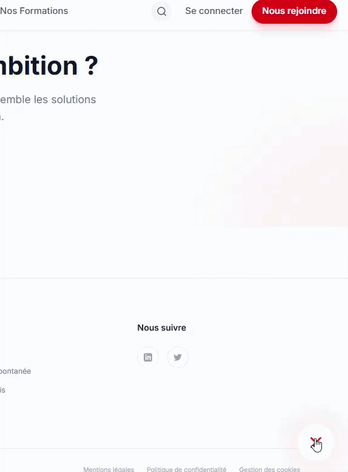
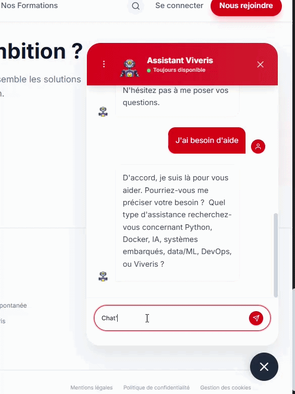

# 🌊 Nuit de l'Info 2025

### 🔗 [Accéder au projet en ligne](http://88.174.229.181:33768/)

## INFO:
- PS: si vous tapez "Chat'bruti + [message]" un nouveau monde s'ouvrira a vous 

---

## 🎬 Démonstrations

### Mode normal

### Mode Chat'bruti 🤖

---

## 🛠️ Technologies utilisées

- **HTML5** - Structure de l'application
- **CSS3** - Design et mise en page
- **JavaScript** - Interactivité
- **Python** - Utilisation d'LLM
- **Node.js** - UI/UX , sécurité
- LLM : Gemma3-1B

# 🌙 Nuit de l'Info 2025 - Chat'bruti + AJIR

> Projet réalisé lors de la Nuit de l'Info 2025

## 🎯 Défis relevés

- **Défi AJIR** : Création d'une plateforme engageante avec UX soignée et gamification
- **Défi Viveris** : Refonte du site avec un chatbot (et une petite surprise dedans)

## 🚀 Fonctionnalités

- Interface intuitive et accessible
- Système de gamification (badges, progression, défis)
- Calls-to-action interactifs
- Design responsive

## 📦 Installation
node.js
python
tensorflow
pytorch
huggingface
npm

## 🎯 Objectifs

- 🌍 **Sensibiliser** à l'importance de la préservation des océans
- 🧠 **Éduquer** sur les liens entre l'océan et le corps humain
- 💡 **Inspirer** une prise de conscience collective
- 🤝 **Encourager** les actions pour protéger notre environnement

---

## 👥 L'équipe

| Membre | GitHub |
|--------|--------|
| **Walid Kebbache** | [@PRIXOOO](https://github.com/PRIXOOO) |
| **Moustapha Makanera** | - |
| **Marwane Benhadj-Amar** | - |
| **Gabriel Fontaine** | - |

---

**Fait avec ❤️ pendant la Nuit de l'Info 2025**

